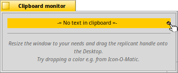

 **Clipdinger** for [Haiku](http://www.haiku-os.org)

* * *

Clipdinger manages a history of the system clipboard. It solves the problem that you often have to paste some text you've just recently copied to the clipboard, but that has been replaced by something you've copied more recently... It also saves the history so it'll appear just as you left it on the last shutdown.

If you want to paste some text that isn't in the clipboard any more, simply hit _SHIFT_ + _ALT_ + _V_ to summon the Clipdinger window. Here you can select an entry with the _CursorUp/Down_ keys and put it into the clipboard or auto-paste it by hitting _RETURN_.

After selecting a clip, you can also paste it to the online service [Sprunge.us](http://sprunge.us) by hitting _ALT_ + _P_. The returned URL for the clip is put into the clipboard for you to paste into your email or IRC channel etc.

_ESCAPE_  or _ALT_ + _W_ aborts and minimizes the Clipdinger window.

### History & Favorites

Clipdinger starts minimized, because it sits in the background and just monitors the system clipboard. When activated by pressing _SHIFT_ + _ALT_ + _V_ its main window pops up:

To the left is a history of your past clippings. For easier orientation, the icon of the app that a clip was copied from is drawn to the left of the text. The top entry is always what's currently in the clipboard. Hover your mouse pointer over an entry for a tool tip with the time and date when a clip was added.

If you have the _Fade history entries over time_ option activated, there'll also be a checkbox _Pause fading_ below the history list. You find more on that further down, where Clipdinger's settings are discussed.

To the right is a list of saved favorites. To make a clip a favorite, you drag & drop a clip from the history on the left into the favorites list to the right. You can also right-click on an entry in the history and choose _Add to favorites_ or use that same menu item from _Clip_ menu in the menu bar. The first 12 entries have automatically an _F-key_ assigned for even quicker pasting of your most used clippings.

You can adjust the size of the history/favorites lists by grabbing the dotted line between them. You can also completely collapse one of those lists. The _F-keys_ will still work, even if your favorites are collapsed.

The _Move up_ and _Move down_ buttons allow for re-ordering the currently selected favorite. Or simply use drag & drop.
_DEL_ or choosing _Remove favorite_ from the (context) menu eliminates an entry. _Edit title_ lets you choose another title for it. By default, the contents of the clip is displayed. You can also change the title of the clips in the history, but it's more useful for the more permanent favorites.

You can quickly switch between the history and favorites lists with _CursorRight/Left_.

### Clipboard monitor

You can open the _Clipboard monitor_ from the _App_ menu. It simply shows the current contents of the clipboard, which helps if you have to continuously switch between some clips from the history/favorites.
The Clipboard monitor is supposed be used as a replicant on the Desktop.

Adjust the window size until it fits your needs, then drag the little handle onto the Desktop. Make sure the option to _Show replicants_ in the Deskbar is active.

You can change the background by dropping a color onto it from any application, like e.g. Icon-O-Matic. Like the icon labels on the Desktop, the color of the text will toggle automatically between black and white according to the brightness of the dropped background color.

As a replicant the Clipboard monitor doesn't need a running Clipdinger to work. Double-clicking on the replicant will, however, summon Clipdinger by either launching it or simply unhiding its main window.

### Settings

This is the settings window, opened with _Settings..._ from the _App_ menu:

At the top of the settings window, you can set the number of entries in the history (the default is 100).
Keep in mind that every clipping is kept in memory and if you copy many large blocks of text, you may clog up your memory. Though, for everyday use, where clippings are seldom larger than a few KiBs at most, having several dozen entries in the history shouldn't tax memory noticeably.

Once the limit of the history is reached, the oldest entry is removed automatically to make room for the new clipping.

You can remove an entry by selecting it and pressing _DEL_ or choose _Remove_ from the (context) menu. You remove the complete clipboard history with _Clear history_ from the _Lists_ menu.

_Auto-start Clipdinger_ controls if Clipdinger will be started automatically at every boot-up.

_Auto-paste_ will put the clipping you've chosen via double-click or _RETURN_ into the window that was active before you have summoned Clipdinger.

The other settings belong to the fading feature: When the checkbox _Fade history entries over time_ is active, entries get darker as time ticks on. You can set the intervall that entries are being tinted (_Delay_) and by how much they are tinted (_Steps_). The third slider sets the _Max. tint level_, i.e. how dark an entry can get.
Below the sliders is a summary of your setting in plain English.

If you leave your computer or just know that you won't do any copy&paste for a longer time, you can simply check the _Pause fading_ checkbox below the history list of the main window to prevent the entries in the history from fading. Note, that this checkbox is only visible if the fading option in the settings is active.

### Tips & Tricks

*	Instead of double-clicking a clip/favorite or hitting _RETURN_ to paste it, you can also drag & drop it into applications or onto the Desktop. That's useful in some situations, especially since it leaves the Clipdinger window open.
*   Changes in the settings window can be viewed live in the main window. To find the right fading settings for you, it's best to keep working normally for some time to fill the history and then just play around with the sliders until you're satisfied.
*   Clipdinger's _Auto-paste_ feature can be a bit tricky: It doesn't know in which window you pressed _SHIFT_ + _ALT_ + _V_ for it to pop up. With activated auto-paste, it simply pastes into last window that was active before you hit _RETURN_ or double-clicked an entry. So, avoid detours...
*   If you want to back-up Clipdinger's settings, history or favorites, or have the need to delete one or all of these files, you'll find them under `/boot/home/config/settings/Clipdinger/`.
*	If the replicant of the Clipboard monitor unexpectedly gives you grief (or any replicant for that matter), you can remove all replicants on the Desktop by deleting `/boot/home/config/settings/Tracker/tracker_shelf`.
*   If you've used Clipdinger before v0.5.5, you can now remove the link to it in the `/boot/home/config/settings/boot/launch/` folder and use the new setting to auto-start instead.

### Download

Clipdinger is directly available through HaikuDepot from the HaikuPorts repository. You can also build it yourself using [Haikuporter](https://github.com/haikuports). The source is hosted at [GitHub](https://github.com/humdingerb/clipdinger).

### Bugreports & Feedback

Please use GitHubs's [issue tracker](https://github.com/humdingerb/clipdinger/issues) if you experience unusual difficulties or email your general feedback to [me](mailto:humdingerb@gmail.com). Also, email me if you'd like to provide more localizations.

### Thanks

I have to thank Werner Freytag who created ClipUp for BeOS which was my inspiration and motivation to work on Clipdinger, to have a similar tool that works as I expect it to under Haiku.
Even more thanks go to Rene Gollent, who pointed out many shortcomings in my amateurish code and provided solutions and patches.
Also, thanks to everyone that contributed translations for Clipdinger.

### History

**1.0** - _24-12-2016:_

*	Add clips to favorites and re-ordering favorites with drag & drop.
*	Drag & drop clips and favorites into other apps.
*	Made history clips titles editable as well.
*	Made the GUI unambiguous. There's only ever one clip shown as active.
*	Added menu items that apply to clips/favorites, re-ordered context menus.
*	Renamed menu to "Lists" and added item to "Clear favorites".
*	Bug fix: Fixed drawing errors of split view handle on resize.
*	Bug fix: Fixed issues when starting without settings file.
*	Bug fix: Fixed crash when trying to paste to sprunge.us with no selection.
*	Bug fix: Put formerly 2nd clip into clipboard when 1st was removed.
*	Bug fix: Correctly show GUI controls availablity (e.g. the move buttons).

**0.5.5** - _28-11-2016:_

*   Added auto-start setting.
*   Added replicatable clipboard monitor.
*	Tweaked fading algorithm to fade much slower now.
*	Added tool tip with the time and date a clip was added to the history.
*	Added localization for British English.
*	Use standard conforming app signature "application/x-vnd.humdinger-clipdinger".
*	Bug fix: Deleting clips with the _DEL_ key was broken.
*	Bug fix: When Clipdinger is launched, add existing clipboard contents to the history.
*	Bug fix: Explanatory text in settings window didn't show 4-digit minutes value and didn't show the correct values when first opened.
*	Bug fix: The time a clip was added was put in too small a variable (32bit), now it's 64bit. Old history clips may experience color problems. Use _Clear history_ in that case.

**0.5.4** - _12-06-2016:_

*   Build fix for gcc5.
*	Fixed typo in Russian localization, thanks to Diver.

**0.5.3** - _11-06-2016:_

*   Bug fix: Make the context menu more robust.
*	Added Russian localization, thanks to Akujiism.

**0.5.2** - _20-01-2016:_

*   Bug fix: The Auto-paste setting was ignored on startup.

**0.5.1** - _07-01-2016:_

*   Made pasting to [Sprunge.us](http://sprunge.us) more robust. It doesn't hang the GUI longer than 2 seconds if the network is down. Puts an error message in the clipboard, also if the service was unavailable.

**0.5** - _04-01-2016:_

*   Added a feature to paste to the online service [Sprunge.us](http://sprunge.us)
*   Bug fix: A chosen favorite will now appear at the top of the clip list, which always shows what's currently in the clipboard.
*   Bug fix: Using the mouse instead of the cursor keys to switch list now correctly shows the inactive list "dimmed".

**0.4** - _01-08-2015:_

*   Bug fixes and optimizations.
*	Added favorites feature.
*   Added a "Pause fading" checkbox.
*   Added a setting for the maximal fading tint.

**0.3** - _21-07-2015:_

*   Added auto-paste setting.
*   Added fading option, to darken history entries over time.
*	Added Help menu item to open ReadMe.html.
*   Bug fixes and optimizations.

**0.2** - _08-07-2015:_

*   Bug fix: First entry wasn't saved on quit.
*   Bug fix: Settings were unnecessarily saved on quit.
*   ALT+W now hides the window.
*   Show the icon of the app a clip was copied from.

**0.1** - _30-06-2015:_

*   Initial release.
