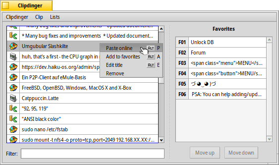

* * *
This repository is in archived, read-only mode. 
Clipdinger development continues at [Codeberg](https://codeberg.org/humdinger/clipdinger).
* * *

 **Clipdinger** for [Haiku](http://www.haiku-os.org)

* * *

Clipdinger manages a history of the system clipboard. It solves the problem that you often have to paste some text you've just recently copied to the clipboard, but that has been replaced by something you've copied more recently... It also saves the history so it'll appear just as you left it on the last shutdown.

For more information, please see the [Clipdinger help file](http://htmlpreview.github.io/?https://github.com/humdingerb/clipdinger/master/documentation/ReadMe.html).

