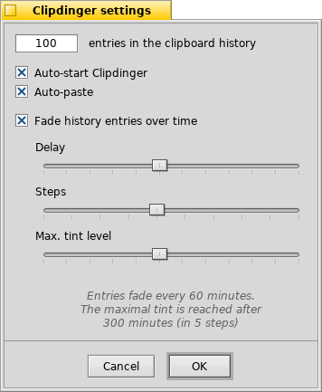

 **Clipdinger** for [Haiku](http://www.haiku-os.org)

* * *

Clipdinger is a small tool to manage a history of the system clipboard. It solves the problem that you often have to paste some text you've just recently copied to the clipboard, but that has been replaced by something you've copied more recently... It also saves the history so it'll appear just as you left it on the last shutdown.

If you want to paste some text that isn't in the clipboard any more, simply hit _SHIFT_ + _ALT_ + _V_ to summon the Clipdinger window. Here you can select an entry with the _CursorUp/Down_ keys and put it into the clipboard or auto-paste it by hitting _RETURN_.
_ESCAPE_  or _ALT_ + _W_ aborts and minimizes the Clipdinger window.

### History & Favorites

Clipdinger starts minimized, because it sits in the background a just monitors the system clipboard. When activated by pressing _SHIFT_ + _ALT_ + _V_ its main window pops up:

To the left is a history of your past clippings (empty, of course, when started for the first time). For easier orientation, the icon of the app that a clip was copied from is drawn to the left of the text. The top entry is always what's currently in the clipboard.

If you have the _Fade history entries over time_ option activated, there'll also be a checkbox _Pause fading_ below the history list. You find more on that farther down, where Clipdinger's settings are discussed.

To the right is a list of saved favorites. You right-click on an entry in the history to the left, and choose Add to favorites to make a clipping a favorite. The first 12 entries have automatically an _F-key_ assigned for even quicker pasting of your most used clippings.

You can adjust the size of history/favorites by grabbing the dotted line between them. You can also completely collapse one of those lists. The _F-keys_ will still work, even if your favorites are collapsed.

The _Move up_ and _Move down_ buttons allow for re-ordering the currently selected favorite.
_DEL_ or choosing _Remove favorite_ from the context menu eliminates an entry. _Edit title_ let's you choose another title for it. By default, the contents of the clip is displayed, just like for the history list on the left.

You can quickly switch between history and favorites lists with _CursorRight/Left_.

### Settings

This is the settings window, summoned with _Settings..._ from the _History_ menu:

At the top of the settings window, you can set the number of entries in the history (the default is 50).
Keep in mind that every clipping is kept in memory and if you copy many large blocks of text, you may clog up your memory. Though, for everyday use, where clippings are seldom larger than a few KiBs at most, having a few dozen entries in the history shouldn't tax memory noticeably.

Once the limit of the history is reached, the oldest entry is removed automatically to make room for the new clipping.

You can remove an entry by selecting it and pressing _DEL_ or choose _Remove clip_ from the context menu. You remove the complete clipboard history with _Clear history_ from the _History_ menu.

_Auto-paste_ will put the clipping you've chosen via double-click or _RETURN_ into the window that was active before you have summoned Clipdinger.

The other settings belong to the fading feature: When the checkbox _Fade history entries over time_ is active, entries get darker as time ticks on. You can set the intervall that entries are being tinted (_Delay_) and by how much they are tinted (_Steps_). The third slider sets the _Max. tint level_, i.e. how dark an entry can get.
Below the sliders is a summary of your setting in plain English.

If you leave your computer or just know that you won't do any copy&paste for a longer time, you can simply check the _Pause fading_ checkbox below the history list of the main window to prevent the entries in the history from fading. Note, that this checkbox is only visible if the fading option in the settings is active.

### Tips & Tricks

*   Obviously, Clipdinger can only keep a clipboard history while it's running. You should therefore create a link to it in the `/boot/home/config/settings/boot/launch/` folder. Then it gets started automatically on every boot-up.
*   All changes in the settings window can be viewed live in the main window. To find the right fading settings for you, it's best to keep working normally for some time to fill the history and then just play around with the sliders until you're satisfied.
*   Clipdinger's _Auto-paste_ feature can be a bit tricky: It doesn't know in which window you pressed _SHIFT_ + _ALT_ + _V_ for it to pop up. With activated auto-paste, it simply pastes into last window that was active before you hit _ENTER_ or double-clicked an entry. So, avoid detours...
*   If you want to back up Clipdinger's settings, history or favorites, or have the need to delete one or all of these files, you'll find them under `/boot/home/config/settings/Clipdinger/`.

### Download

Clipdinger is directly available through HaikuDepot from the HaikuPorts repository. You can also build it yourself using [Haikuporter](https://github.com/haikuports). The source is hosted at [GitHub](https://github.com/humdingerb/clipdinger).

### Bugreports & Feedback

Please use GitHubs's [issue tracker](https://github.com/humdingerb/clipdinger/issues) if you experience unusual difficulties or email your general feedback to [me](mailto:humdingerb@gmail.com). Also, email me if you'd like to provide more localizations.

### Thanks

I have to thank Werner Freytag who created ClipUp for BeOS which was my inspiration and motivation to work on Clipdinger, to have a similar tool that works as I expect it to under Haiku.
Even more thanks go to Rene Gollent, who pointed out many shortcomings in my amateurish code and provided solutions and patches.
Also, thanks to everyone that contributed translations for Clipdinger.

### History

**0.1** - _30-06-2015:_

*   Initial release.

**0.2** - _08-07-2015:_

*   Bug fix: First entry wasn't saved on quit.
*   Bug fix: Settings were unnecessarily saved on quit.
*   ALT+W now hides the window.
*   Show the icon of the app a clip was copied from.

**0.3** - _21-07-2015:_

*   Added auto-paste setting.
*   Added fading option, to darken history entries over time.
*	Added Help menu item to open ReadMe.html.
*   Bug fixes and optimizations.

**0.4** - _1-8-2015:_

*   Bug fixes and optimizations.
*	Added favorites feature.
*   Added a "Pause fading" checkbox.
*   Added a setting for the maximal fading tint.
